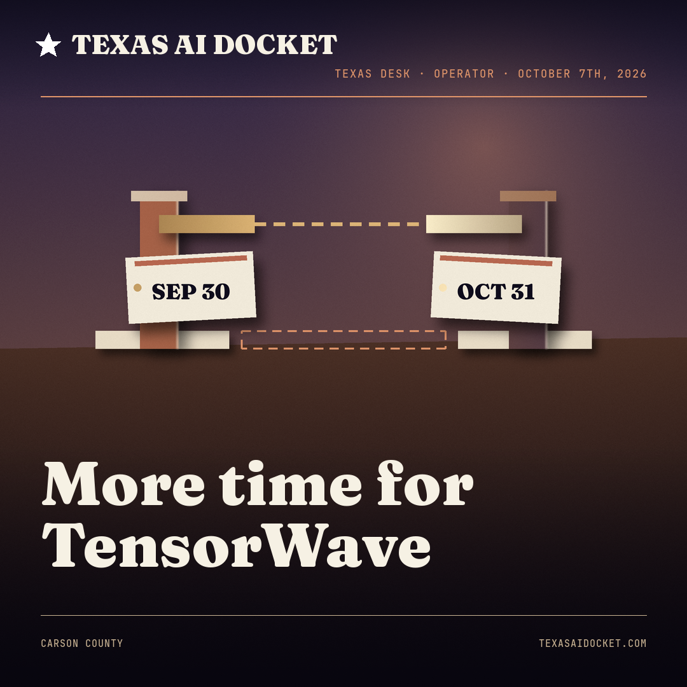

# LinkedIn Texas AI Desk

Texas Desk is a daily, decision-anchored LinkedIn column for **Texas AI Docket**. Each run finds
one Texas founder, operator, public-sector administrator, or research lead tied to a specific
recent decision, verifies the decision against primary and independent sources, writes a
copy-ready post, renders a square cover, and saves the package as an **unsent Gmail draft**.

This repository is a Texas-focused rebuild of the Anchorage Desk workflow in
[`Talonsturgill/linkedin-alaska-ai-weekly`](https://github.com/Talonsturgill/linkedin-alaska-ai-weekly).
It intentionally contains only the Desk column rather than the Alaska repository's other columns.

## What arrives in Gmail

- the exact text to copy into LinkedIn
- a 1080 by 1080 image plus a permanent, commit-pinned download link
- the primary source and independent corroborators
- the quality score and any editor caveats
- an explicit no-target report when no defensible subject clears the gate

The workflow never sends the email and never posts to LinkedIn.

## Coded artwork

Each profile cover is original art written as code for its story (`out/artwork.py`), rendered with
Pillow and numpy, and finished with exact publication type. The gate recomputes provenance, base and
final pixels, anchors and labels, and variety against committed history. Historical acceptance covers
live in `examples/coded_art/`. The older ImageGen example `examples/texas_desk_cover.png` remains
legacy and is never used for new profiles.



## Repository map

- `prompts/ROUTINE_PROMPT.txt` is the thin scheduler trigger.
- `prompts/texas_desk_routine.md` is the authoritative end-to-end routine.
- `config/` contains voice, source, cadence, and quality policy.
- `references/dossier_schema.md` defines the research handoff.
- `scripts/` supplies deterministic copy, configuration, history, email, and run gates.
- `.agents/skills/texas-desk-artwork/` is the repo-local Codex artwork skill.
- `tests/` exercises failure paths as well as the happy path.

## Local verification

```bash
python3 -m venv .venv
. .venv/bin/activate
python3 -m pip install -r requirements.txt
python3 -m unittest discover -s tests -v
python3 scripts/check_config.py
```

To build one story's cover after authoring its `artwork.py` and `art_direction.json`:

```bash
python3 .agents/skills/texas-desk-artwork/scripts/build_art.py --story-dir out
python3 .agents/skills/texas-desk-artwork/scripts/art_gate.py --out-dir out --date 2026-10-07
```

The build renders within the attempt budget, updates hashes, recomposes the cover, writes
`out/thumb_300.png`, and resets any visual review whose pixels changed. It never marks a check true.

## Scheduled operation

The scheduler should run this repository in a persistent local checkout so it can use remote
branch history for deduplication. Each run starts from `origin/main`, creates a unique
`codex/texas-desk-*` branch, pushes gated artifacts, verifies the permanent image URL, and then
creates or updates that day's Gmail draft. Review the first few runs before treating the cadence
as settled.

## Lineage

- Alaska template commit inspected: `ba728b3`.
- Supplied Alaska master prompt SHA-256:
  `01d48efdd3148788d3166f71ae127a8b856e48b6ec7cae2a69f13c1208acdc32`.
- Texas voice and visual tokens are derived from the TexasAIDocket brand constitution, not from
  a search-and-replace of Alaska geography.
